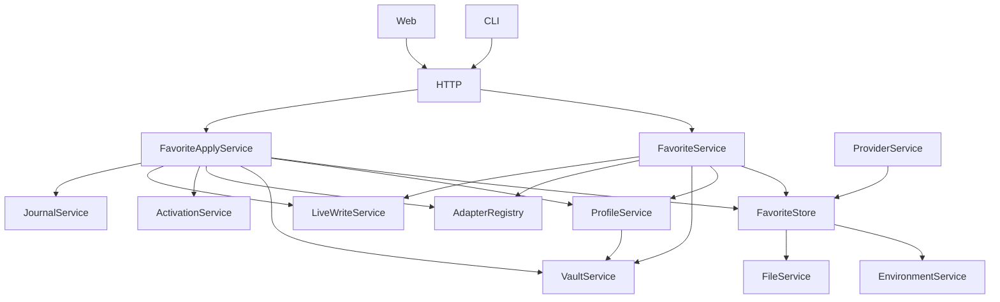

# 模型收藏夹实现与验证记录

对应 [模型收藏夹 Spec](model-favorites.zh-CN.md)。实现包含收藏 CRUD、多渠道参数覆盖、从配置收藏、关联状态和解除关联、保存/激活计划、持久化结果查询、Web/CLI 入口、v2 导入导出及跨用户依赖复制。尚未通过五种 CLI 的实机发布验收，不能据此发布兼容承诺。

## 服务边界

ProfileService 不依赖收藏服务；adapter 投影是无凭据纯函数。仅保存路径不会调用 `syncProfile`，计划中的原生写入集合为空。激活继续使用现有 adapter renderer，原配置回读及 active 更新进入 LiveWrite 的 metadata 回滚边界。

计划有效期十分钟，绑定会话和当前用户目录。收藏修订、完整目标 profile、Vault、active 和原生文件变化都会使未提交计划失效。服务中的检查和本地写入同步执行，依靠单进程 JavaScript 的执行到完成语义串行化，事务内没有网络 await；没有新增跨进程文件锁。外部 CLI 修改仍由提交前指纹核对发现，无法保证对外部并发写入的绝对隔离。

每工具独立 journal 事务持久化 request/plan 身份及结果。普通失败回滚后继续，恢复降级或无法写入收据时停止。重复请求读取原收据，不重放写入；重启后未执行项需重新预览。新 metadata 收据记录提交后指纹，撤销遇到后续改动会拒绝覆盖。

迁移 payload 默认 v2，导出 v1 必须显式选择且剥离收藏关系；加密 envelope 仍为 v1。导入及跨用户复制重映射收藏、渠道和 Vault 身份；跳过的同名 profile 保留原关联。

## 自动化和隔离验证

- 收藏编辑的渠道区使用独立卡片，供应商/入口与协议并排，模型字段统一为可搜索、可添加自定义值的 Radix Popover/cmdk 选择器。目录加载/刷新在模型字段旁，渠道名称和参数覆盖位于下方折叠区；切换供应商保留模型 ID 并切换目录来源，过时请求不覆盖新渠道的加载反馈。
- 目录不会自动请求；手动值在无目录或目录失败时仍可保存。测试验证目录选择保留原始大小写与路径、无目录键盘输入并保存、切换入口隔离目录来源。实机加载当前供应商目录 23 项并检查合并选择器；未保存或应用用户配置。

- 预览以原生文件的当前内容→写入后为主，已保存档案的对照单独折叠，避免将档案无变化误读为当前工具配置无变化。固定批次摘要及工具数确认按钮，Tab 提示变更数和阻塞，Pierre 默认折叠未变长段。
- 新备份记录操作、收藏名称及相关工具，操作信息同样加密落盘；旧备份沿用已有原因。恢复确认先请求只读影响预览，区分替换、还原缺失文件、删除和不变，明确为全局恢复。确认携带当前状态指纹，预览后状态变化则拒绝并要求重新检查；保留旧客户端无指纹恢复接口兼容性。
- 新增回归验证影响预览不泄露内容、不写入当前文件、过时确认拒绝、重新预览后恢复、加密操作信息与旧备份兼容；Web 验证预览失败不可确认以及保存档案与原生配置比较的区分。实机仅验证预览与恢复影响界面，未执行真实激活或恢复。

- 文件预览保留模型映射、环境变量中的普通配置、地址及权限设置，仅隐藏凭据字段、已知 API key 和 URL 内的认证信息；JSON/TOML/YAML 均有脱敏回归测试。
- 预览按工具分成 Tab，固定标签栏与底部操作区，每个工具的差异独立滚动；切换 Tab 不改变批次应用范围。实际 localhost:8787 验证 Claude/Kimi 切换及 Pierre 差异中的模型值与凭据脱敏，未执行激活。

日期：2026-09-05。测试沿用仓库 support，凭据均为测试数据。

最终完整运行（渠道卡片与统一模型选择器调整后）：服务端 395 项通过，Web 188 项通过；typecheck、lint、Biome 和 Web build 退出码均为 0。

开发服务输出到 `apps/server/.dev-public`，生产构建输出到 `apps/server/public`。开发环境保留旧的带哈希 chunk，生产构建不再清理开发资源；CopyRspackPlugin 跟随实际输出目录。缺失的静态资源返回不可缓存的 404，不回退为 SPA HTML。已在开发服务运行期间执行生产构建并逐文件核对：50 个开发文件哈希不变，8787 端口的全部 9 个 JavaScript chunk 返回正确类型及内容。

### 交互精简与恢复点

- 备份与恢复入口位于全局顶栏，工具页面和收藏页面均可使用。手动添加弹窗固定标题和底部保存栏，只有表单区域滚动。
- 配置向导分为「选择工具」和「预览并确认」两步，左右滑动切换；非当前步骤 inert 并从无障碍树隐藏，步骤切换管理焦点，减少动画偏好下不执行过渡。返回保留选择，调整输入后必须重新预览。
- 工具选择使用品牌图标、渠道摘要及选中状态卡片；预览页展示目标/激活/文件计数、参数对照及每工具结果。原生文件差异复用 `ConfigDiffs` 的 `@pierre/diffs` 渲染器，传入脱敏前后内容，不再自行并排展示原始文本。

- 从已有配置收藏改为按需展开；名称可沿用模型 ID，渠道名称可沿用供应商名称。能力、思考、备注和渠道覆盖放入高级设置。
- 配置到工具时，唯一可用渠道自动选中，唯一已有关联配置默认更新；默认仅保存。是否立即激活对整个批次只选一次，目标名称和新建/更新选择可按需展开。协议不兼容仍不可选，无法表达的偏好和覆盖本地分歧仍需显式确认。
- 预览默认显示工具、模型、操作方式、参数对照、写入文件及告警；映射依据按需展开，原生文件差异直接展示。
- 收藏创建、修改、删除、解除关联、capture、应用和包含收藏的 journal 迁移操作前自动创建恢复点。保留 20 个自动恢复点，另保留一个手动恢复点；新建手动恢复点替换之前的手动点。
- 恢复点覆盖当前用户的收藏、profiles、Vault、active、env.sh 及五种 adapter 管理的原生配置文件。恢复会覆盖该范围此后的修改，包括删除备份时尚不存在的文件；UI 先说明范围，再确认恢复。服务登录、密码、加密主密钥和操作历史不回退。
- 恢复点由本机 AES 密钥加密，落盘权限 0600，列表 API 返回时间、来源及可用的操作名称和工具信息；恢复预览 API 仅返回文件路径、影响类型和确认指纹，不返回文件内容或凭据。它依赖当前用户目录及本机密钥，不是异机灾备包；异机迁移继续使用现有加密导出。
- 恢复前再创建当前状态恢复点，并持久化加密 pending 回滚点。恢复失败或进程中断时恢复先前状态；每次受保护请求前先处理 pending，回滚失败则阻止配置访问，避免继续修改半恢复状态。配置路径改变或密文损坏时拒绝恢复。

增补测试验证完整还原、缺失文件删除、恢复操作撤回、自动轮换不移除手动点、密文篡改拒绝、恢复失败和重启回滚，以及 Web 简化选项与恢复确认。

- 服务端完整测试覆盖存储拒绝损坏输入、参数投影与清除、PATCH 保留省略字段、仅保存不写原生配置、受控字段保护、引用约束、计划失效、事务故障回滚、批次部分成功、重启查询、幂等重试、撤销冲突及 v1/v2 迁移。
- Web 完整测试包含收藏搜索不探测上游、断开渠道仍可见、关联状态和删除保护。
- 类型检查、lint、格式检查及 Web 构建。lint 存在原有 i18next 导入警告；构建存在既有包体积警告。
- Chrome 在临时 HOME/dataDir 的本地服务验证：新增收藏、选择渠道、Pi 保存预览、确认并显示成功；没有改动日常工具配置。
- 实际运行项目 CLI 的 favorites、plan、apply、同 request-id 重试、capture/link-source；确认 DSH 仅保存未创建原生 settings 文件。

这不是 A01–A24 每个故障组合的完整证明；尤其 kill/recovery 和五种外部 CLI 的读取行为仍须按 spec 发布验收。

## 实机发布门槛

本机仅核实以下版本可执行，不等同于已完成生成配置读取、模型切换或上游请求：

| CLI | 版本 | 新建收藏配置的实机验收 |
| --- | --- | --- |
| Claude Code | 2.1.260 | 待验证 |
| Codex CLI | 0.153.1 | 待验证 |
| Kimi | 0.39.1 | 待验证 |
| Pi | 未安装 | 待准备环境并验证 |
| DSH | 0.1.2-rc.1 | 待验证 |

评审后应使用隔离 HOME、测试账号和对应 endpoint，对五种 CLI 完成全新 profile 激活、原生 provider ID 冲突、真实读取及必要的显式 completion 检查，并记录版本、命令、结果与无凭据泄露的证据。未完成前 PR 保持草稿，不合并或发布。
